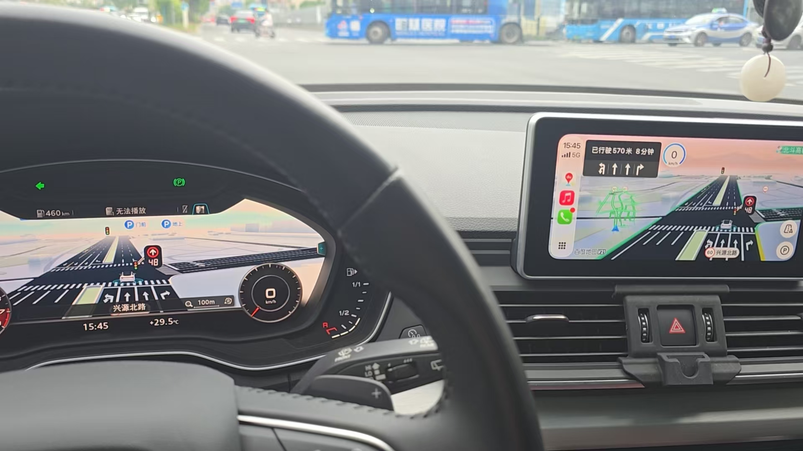

# MHI2Q CarPlay AltScreen / MHI2Q CarPlay 第二屏

[中文](#中文) · [English](#english)

*实车参考图片：CarPlay 第二屏显示在 Virtual Cockpit 仪表盘上。 / Vehicle reference: CarPlay secondary display on the Virtual Cockpit instrument cluster.*

## 中文

本项目面向搭载 **Audi MHI2Q / MIB2 High AUG22 固件**的车辆，补全 **CarPlay AltScreen（CarPlay 第二屏）**的处理逻辑，使 CarPlay 的导航第二屏画面能够直接显示在车辆的 **Virtual Cockpit 仪表盘**上。本仓库提供可放入 SD 卡根目录的安装文件；具体兼容性以安装脚本的固件核验结果为准。操作前请先阅读 [SD 卡说明](SD_CARD_README.txt)。

### 当前状态

- 仓库根目录的 AUG22 / V2.1 文件已经完成实车验证，可在 Virtual Cockpit 仪表盘显示 CarPlay 第二屏，画面能随手机导航更新。
- 仅面向安装脚本能够核验的 AUG22 固件；其他固件不应强制安装。

### 安装与测试

#### 1. 准备 SD 卡

1. 先在车机信息页确认固件版本。此包面向安装脚本能够核验的 **AUG22** 固件；若版本不符、无法确认，或车机拒绝更新包，就停止操作，不要强制刷入。当前根目录提供已完成实车验证的 **AUG22 / V2.1** 文件。
2. 车辆停稳，保持稳定供电。备份正在使用的 SD 卡及原车文件，并准备一张可正常读写的 **FAT32** SD 卡。
3. 下载仓库 ZIP 并解压，**将仓库根目录的内容直接复制到 SD 卡根目录**，不要再套一层仓库名或“SD卡”文件夹。卡根目录应直接看到 `metainfo2.txt`、`Toolbox`、`SD_CARD_README.txt`、`SHA256SUMS-SD.txt`。`README.md`、根目录 `LICENSE` 和 `.gitattributes` 不参与车机安装，可不复制。
4. 如果旧卡已有 `MMI-Cockpit-Carplay` 目录，换卡时把该目录完整复制到新卡；它含有原车备份及诊断资料。以后执行恢复时要插入**含原车备份**的卡，不能只用一张新复制的空白卡。
5. 复制完成后，在 SD 卡根目录用 Git Bash、Linux 或其他提供 `sha256sum` 的环境运行 `sha256sum -c SHA256SUMS-SD.txt`，确认清单中的文件均为 `OK`。清单仅覆盖选定的 38 个运行文件，不覆盖仓库全部文件。

#### 2. 安装或更新 MIB Toolbox

1. **车上已有 MIB Toolbox：**插入本卡，在 Toolbox 菜单执行 `Update Toolbox`，更新工程菜单和脚本。更新完成后确认能看到 `MMI-Cockpit-Carplay` 菜单。
2. **车上没有 MIB Toolbox：**通过车机的**软件更新**入口选择本卡的更新包（卡根目录的 `metainfo2.txt`），安装随卡提供的菜单和脚本；完成后进入 Toolbox 工程菜单，确认有 `MMI-Cockpit-Carplay`。不同车机的入口名称可能不同，以车机实际显示为准。
3. 如果软件更新入口不识别卡或拒绝该包，检查 FAT32 格式及根目录结构；仍被拒绝就停止，不要绕过车机或安装脚本的兼容性检查。

#### 3. 安装第二屏并启动

在 `MMI-Cockpit-Carplay` 菜单中按以下顺序操作，每步完成后再进行下一步：

1. **断开 iPhone / CarPlay**，避免安装过程中正在输出导航视频。
2. 选择 `INSTALL`。等待执行结束；看到 `INSTALL=PASS` 且提示 `reboot_required=YES` 后，**完整重启车机**。若出现 `FAIL`，先记录提示并停止后续步骤。
3. 重启完成后选择 `START`。等待 `START=PASS` 和 `reboot_required=YES`，然后**再次完整重启车机**。若失败，不要直接跳到连接手机。
4. 第二次重启后连接 iPhone、进入 CarPlay 并启动导航。观察 Virtual Cockpit 是否出现第二屏画面且能随导航更新。收到有效第二屏视频后，启动 Logo 约显示 2 秒；它不是整车开机 Logo。

#### 4. 查看状态和排查

- 在 CarPlay 导航运行时打开 `STATUS`。`PHYSICAL_ROUTE_READY=SOFTWARE_CHAIN_COMPLETE` 表示脚本观察到视频解码、显示链路和 Context 80 等软件条件；仍须**亲眼确认仪表实际显示画面**。`PHYSICAL_ROUTE_READY=NO` 表示条件未齐，按输出中的缺失项检查。
- 若看不到菜单，先确认 `Update Toolbox` 或软件更新已完成。若 SD 卡找不到，核对 FAT32、卡根目录文件和读写状态。若 `STATUS` 不就绪，确认已连接 CarPlay 且导航正在输出，再记录状态及日志；不要反复强制执行 `START`。
- `STORE LOGS + RESTORE` 会尽力保存诊断日志，**随后立即恢复原车配置**；它不是只导出日志的按钮。需要保留第二屏运行时，不要选择它。

#### 5. 恢复原车

1. 插入保留了 `MMI-Cockpit-Carplay` 原车备份目录的 SD 卡，在菜单选择 `RESTORE ORIGINAL`；若要先收集日志再恢复，选择 `STORE LOGS + RESTORE`。
2. 等待 `RESTORE=PASS` 和 `reboot_required=YES`，然后完整重启车机。恢复会删除本项目的 HMI JAR，并还原相关原车配置。
3. 如果安装或恢复中断，运行会保持关闭。保留原备份卡，先重新执行 `RESTORE ORIGINAL`，确认恢复成功后再考虑重新 `INSTALL`；不要在恢复未完成时继续 `START`。

详细运行说明见 [SD 卡说明](SD_CARD_README.txt)。车机修改有黑屏或需要恢复的风险。
### 许可与第三方文件

本项目由 [yuedizhibo](https://github.com/yuedizhibo) 和 [Lanye-z](https://github.com/Lanye-z) 共同开发。仓库根目录的 [PolyForm Noncommercial 1.0.0 许可](LICENSE)仅适用于相应权利人有权按该许可发布的原创部分：允许非商业使用、修改和分发；商业使用须另行取得相关权利人的许可。由于限制商用，本项目属于**源码可见的非商业许可**，不属于 OSI 定义的开源许可。

仓库中包含第三方文件，其原有授权不因仓库根目录的许可而改变。上游 MIB2 Toolbox 的 [MIT 许可](LICENSE.TOOLBOX-MIT)和镜像运行组件的[独立许可](Toolbox/carplay_alt_screen/mirror_display/release/LICENSE.MMI-MIRROR)均须保留；使用或再分发时应分别遵守其条款。

研究与实现参考项目：

- [LIVI](https://github.com/f-io/LIVI)：CarPlay 主屏与仪表第二屏协议行为的研究参考。
- [mib2q-carplay-rgi](https://github.com/luka-dev/mib2q-carplay-rgi)：MHI2Q 的 CarPlay 导航引导、HMI 与仪表交互参考。
- [MIB2 High Toolbox](https://github.com/jilleb/mib2-toolbox)：SD 卡工具链、工程菜单及脚本的上游项目。

## English

This project completes the **CarPlay AltScreen (secondary display)** logic for vehicles with **Audi MHI2Q / MIB2 High AUG22 firmware**, allowing the CarPlay navigation secondary display to appear directly on the vehicle's **Virtual Cockpit instrument cluster**. The repository provides installation files for the root of an SD card; actual compatibility is determined by the installer's firmware checks. Read the [SD card instructions](SD_CARD_README.txt) before changing the head unit.

### Status

- The AUG22 / V2.1 files at the repository root have been verified in a vehicle. The CarPlay secondary display appears on the Virtual Cockpit and updates with phone navigation.
- Use only on AUG22 firmware accepted by the installer's checks. Do not force installation on other firmware.

### Installation and testing

#### 1. Prepare the SD card

1. Check the firmware version on the head unit first. This package is for **AUG22** firmware that the installer can verify. Stop if the version is different, uncertain, or the head unit rejects the update package; do not force installation. The repository root contains vehicle-verified **AUG22 / V2.1** files.
2. Park the vehicle and maintain stable power. Back up the SD card in use and the stock files. Prepare a working, writable **FAT32** SD card.
3. Download and extract the repository ZIP. **Copy the contents of the repository root directly to the SD card root**; do not add an enclosing repository-name or “SD卡” folder. The card root should directly contain `metainfo2.txt`, `Toolbox`, `SD_CARD_README.txt`, and `SHA256SUMS-SD.txt`. `README.md`, the root `LICENSE`, and `.gitattributes` are not needed for installation and may be omitted.
4. If the old card has an `MMI-Cockpit-Carplay` directory, copy that entire directory to the replacement card. It contains stock backups and diagnostic material. A later restore requires the **card with the stock backup**, not a newly copied blank card.
5. After copying, run `sha256sum -c SHA256SUMS-SD.txt` from the card root using Git Bash, Linux, or another environment with `sha256sum`; confirm that listed files report `OK`. The manifest covers 38 selected runtime files, not every repository file.

#### 2. Install or update MIB Toolbox

1. **MIB Toolbox already installed:** insert this card and run `Update Toolbox` from the Toolbox menu to refresh the engineering menu and scripts. Confirm that the `MMI-Cockpit-Carplay` menu appears.
2. **No MIB Toolbox installed:** use the head unit's **software update** entry to select the package on this card (with `metainfo2.txt` at the card root). Install the supplied menu and scripts, then open the Toolbox engineering menu and confirm `MMI-Cockpit-Carplay` appears. Entry names can vary by head unit; follow the labels shown on yours.
3. If software update cannot read the card or rejects the package, check FAT32 formatting and the root layout. If it still rejects the package, stop; do not bypass the head unit's or installer's compatibility checks.

#### 3. Install and start the secondary display

In the `MMI-Cockpit-Carplay` menu, follow this order and let each action finish before continuing:

1. **Disconnect the iPhone / CarPlay** so navigation video is not playing during installation.
2. Select `INSTALL`. Wait until it finishes. After `INSTALL=PASS` and `reboot_required=YES`, **fully reboot the head unit**. If it reports `FAIL`, record the message and stop.
3. After the reboot, select `START`. Wait for `START=PASS` and `reboot_required=YES`, then **fully reboot the head unit again**. If it fails, do not proceed straight to connecting the phone.
4. After the second reboot, connect the iPhone, enter CarPlay, and start navigation. Check whether the Virtual Cockpit shows the secondary display and updates with navigation. Once valid secondary-display video arrives, the startup logo appears for about two seconds; it is not the vehicle boot logo.

#### 4. Check status and troubleshoot

- With CarPlay navigation running, open `STATUS`. `PHYSICAL_ROUTE_READY=SOFTWARE_CHAIN_COMPLETE` means the script observed the decoder, display path, Context 80, and other software conditions; you must still **visually confirm the image on the Virtual Cockpit**. `PHYSICAL_ROUTE_READY=NO` means some conditions are missing; inspect the fields it prints.
- If the menu is missing, check that `Update Toolbox` or software update completed. If the card is not detected, check FAT32, the root layout, and whether it is writable. If `STATUS` is not ready, confirm that CarPlay is connected and navigation is producing output, then save the status and logs; do not repeatedly force `START`.
- `STORE LOGS + RESTORE` tries to collect diagnostics and **then immediately restores the stock configuration**. It is not a logs-only action. Do not select it if you intend to keep the secondary display running.

#### 5. Restore the stock configuration

1. Insert the SD card that retains the `MMI-Cockpit-Carplay` stock-backup directory. Select `RESTORE ORIGINAL` in the menu, or `STORE LOGS + RESTORE` if you want to collect logs before restoring.
2. Wait for `RESTORE=PASS` and `reboot_required=YES`, then fully reboot the head unit. Restore removes this project's HMI JAR and restores the related stock configuration.
3. If installation or restore was interrupted, runtime remains disabled. Keep the original backup card, run `RESTORE ORIGINAL` again, confirm that it succeeds, and only then consider running `INSTALL` again. Do not continue with `START` while restore is incomplete.

See the [SD card instructions](SD_CARD_README.txt) for additional runtime notes. Changing head unit system files can cause a blank screen or require recovery.
### Licensing, authors, and third-party files

This project is developed by [yuedizhibo](https://github.com/yuedizhibo) and [Lanye-z](https://github.com/Lanye-z). The repository-root [PolyForm Noncommercial 1.0.0 license](LICENSE) applies only to original material that the relevant rights holders can license under those terms. It permits noncommercial use, modification, and distribution; commercial use requires separate permission from the relevant rights holders. Because commercial use is restricted, this is **source-available noncommercial software**, not OSI-defined open source.

Third-party files retain their existing licenses. Preserve the upstream MIB2 Toolbox [MIT license](LICENSE.TOOLBOX-MIT) and the mirror runtime's [separate license](Toolbox/carplay_alt_screen/mirror_display/release/LICENSE.MMI-MIRROR), and follow each license when using or redistributing those files.

Research and implementation references:

- [LIVI](https://github.com/f-io/LIVI): reference for CarPlay main and instrument-cluster secondary-display protocol behavior.
- [mib2q-carplay-rgi](https://github.com/luka-dev/mib2q-carplay-rgi): reference for CarPlay route guidance, HMI integration, and cockpit interaction on MHI2Q.
- [MIB2 High Toolbox](https://github.com/jilleb/mib2-toolbox): upstream SD card tooling, engineering menu, and scripts.
