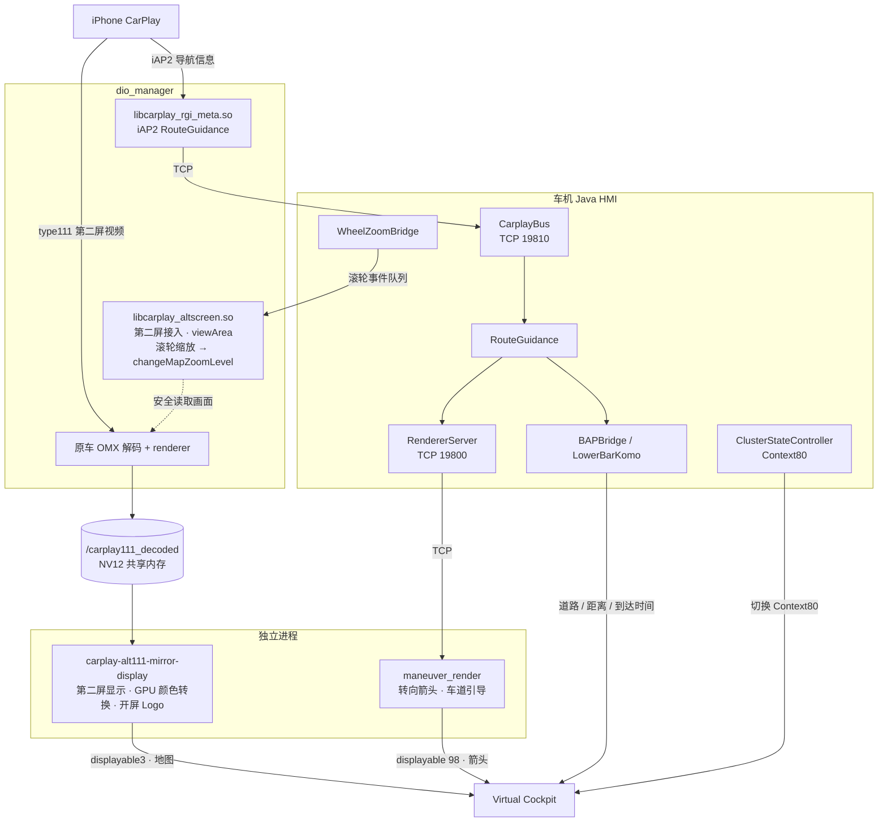

# MIB2 Toolbox — CarPlay AltScreen V3.7Fix3

[English](README_EN.md) | **简体中文**

本项目面向 Audi **MHI2Q** 平台，用于将 **CarPlay 原生 AltScreen / 第二屏导航画面**直接显示至车辆的 **Virtual Cockpit**。核心显示链路已完成实车验证。操作前请完整阅读本说明。

**V3.7 更新：完整 RGI 导航信息联动上线（基于 [Luka 的 mib2q-carplay-rgi](https://github.com/luka-dev/mib2q-carplay-rgi) 构建）；第二屏颜色转换改由 GPU 完成，整机 CPU 占用率从约 80% 降至约 20%；运行水印已移除；V3.7 起全部以 GPL-3.0 开源。**

**V3.7Fix3 更新：`INSTALL WITH RGI` / `INSTALL NO RGI` 安装与启用合为一步，全程只需重启一次，旧版本自动卸载；修复安装时误报 `Another INSTALL / RESTORE is still running`；修复第二屏连接与退出的并发问题，长时间无画面时自动请求恢复；补齐 Q7 仪表布局的安全区识别。**

> [!NOTE]
> **姊妹项目：MMI Mirror**  
> 如果你希望显示的是 **MMI 中控完整画面镜像**，而不是 CarPlay 原生第二屏，请前往：  
> **[MHI2Q-CarPlay-MMI-Mirror](https://github.com/Lanye-z/MHI2Q-CarPlay-MMI-Mirror)**

> [!TIP]
> **交流群**  
> 欢迎加入交流群，讨论安装使用、反馈问题、分享实车测试结果：  
> - QQ 群：**823297190**  
> - Telegram：[https://t.me/+xZ2pabi2nmk1MDI9](https://t.me/+xZ2pabi2nmk1MDI9)

> [!WARNING]
> **⚠️ 写在前面**
>
> 考虑到此前免费测试成果曾被未经允许包装和倒卖，本项目早期版本只公开了运行包，并分阶段发布功能。**自 V3.7 起，本项目全部开源**：全部功能与源码均已在本仓库公开。
>
> 本项目整体采用 **[GNU GPL v3.0](LICENSE)** 许可：任何人都可以使用、修改和再分发；再分发二进制或修改版时，必须以 GPL-3.0 同时提供完整源码。详见文末「许可、作者与第三方文件」。
>
> 当前版本并非演示代码，现有 CarPlay AltScreen 第二屏功能已经可以正常实车使用。
>
> 本项目最初就是基于我们自己的车辆和日常使用需求进行开发。**中国区（CN）AUG22 固件已经过实车测试，可以正常使用。** US / ER 等其他地区的 AUG22 固件可能存在未知 BUG，**不保证 100% 可用**，请自行评估风险并保留好原车备份。本项目不支持 MHI2 平台；请不要绕过安装脚本的固件检查强制安装。
>
> **免费分享。** 本项目的源码和安装包都可以在 GitHub 上免费获取，请不要花钱购买。
>
> 欢迎学习、研究和交流。如果有人向你提供本项目或其修改版，你有权按 GPL-3.0 向对方索取完整源码。

> [!IMPORTANT]
> 本项目会修改车机系统文件。安装、启动或恢复过程中请保持 SD 卡连接和车机供电稳定。  
> **安装或恢复完成后，请按照页面中的步骤完整重启车机 / HMI，再判断结果。**
>
> 请勿在驾驶过程中进行安装、更新、恢复或故障处理。

---

## 实车效果


---

## 当前公开版本已支持

- CarPlay 原生 AltScreen
- CarPlay 主屏正常使用，不受第二屏影响
- 完整 RGI 导航信息联动（基于 [Luka 的 mib2q-carplay-rgi](https://github.com/luka-dev/mib2q-carplay-rgi) 构建）
  - 仪表转向箭头与车道引导
  - 当前道路、剩余距离、到达时间同步到仪表底部信息栏
  - 可在安装时选择是否启用（`INSTALL WITH RGI` / `INSTALL NO RGI`）
- Classic / Sport 动态布局适配
- 全域居中
- 方向盘左侧滚轮缩放
- 仪表地图显示限速牌和指南针，不叠加 ETA
- GPU 颜色转换：整机 CPU 占用率从约 80% 降至约 20%
- STATUS 状态诊断
- 安全安装与恢复
- 安装 / 恢复中断保护
- 原车配置恢复
- 日志与 SD 卡备份

## 适用范围

| 项目 | 状态 |
|---|---|
| 平台 | 仅 **MHI2Q**；不支持 MHI2 |
| 固件版本 | **AUG22**；安装脚本会核验车机固件版本，非 AUG22 会拒绝安装 |
| 中国区（CN）固件 | ✅ 已实车测试，可以正常使用 |
| US / ER 等其他地区固件 | ⚠️ 可能存在未知 BUG，不保证 100% 可用 |
| iPhone 系统版本 | ✅ 推荐 **iOS 26**；⚠️ 低于 iOS 18 时，百度地图可能不支持仪表第二屏，高德地图可能出现画面比例异常 |

> [!TIP]
> 本项目主要在 **iOS 26** 上完成适配和测试。如果仪表上看不到百度地图画面，或高德地图比例不正常，请先把 iPhone 升级到 iOS 18 或更高版本（推荐 iOS 26）再排查。

---

## 工作原理与架构

本项目不再依赖早期的 Window58 读取路线，而是直接接入 CarPlay 的 **private type111** 第二屏视频流：保留原车 AirPlay / OMX 解码流程，从原车 renderer 安全读取画面并线性化为标准 NV12，再交给独立显示进程，最终通过 GLES / displayable3 / Java Context80 输出到仪表。完整 RGI 则通过 iAP2 RouteGuidance 取得导航信息，由 Java HMI 分发给仪表底部信息栏和独立的转向箭头渲染器。

### 架构图


```mermaid
flowchart TB
    iPhone["iPhone CarPlay"]

    subgraph DIO["dio_manager"]
        OMX["原车 OMX 解码 + renderer"]
        ALT["libcarplay_altscreen.so<br/>第二屏接入 · viewArea<br/>滚轮缩放 → changeMapZoomLevel"]
        RGIM["libcarplay_rgi_meta.so<br/>iAP2 RouteGuidance"]
    end

    SHM[("/carplay111_decoded<br/>NV12 共享内存")]

    subgraph HMI["车机 Java HMI"]
        BUS["CarplayBus<br/>TCP 19810"]
        RG["RouteGuidance"]
        BAP["BAPBridge / LowerBarKomo"]
        RS["RendererServer<br/>TCP 19800"]
        CSC["ClusterStateController<br/>Context80"]
        WZ["WheelZoomBridge"]
    end

    subgraph SIDE["独立进程"]
        MIR["carplay-alt111-mirror-display<br/>第二屏显示 · GPU 颜色转换 · 开屏 Logo"]
        MR["maneuver_render<br/>转向箭头 · 车道引导"]
    end

    VC["Virtual Cockpit"]

    iPhone -- "type111 第二屏视频" --> OMX
    iPhone -- "iAP2 导航信息" --> RGIM
    ALT -. "安全读取画面" .-> OMX
    OMX --> SHM --> MIR
    RGIM -- "TCP" --> BUS --> RG
    RG --> BAP
    RG --> RS -- "TCP" --> MR
    WZ -- "滚轮事件队列" --> ALT
    MIR -- "displayable3 · 地图" --> VC
    MR -- "displayable 98 · 箭头" --> VC
    BAP -- "道路 / 距离 / 到达时间" --> VC
    CSC -- "切换 Context80" --> VC
```

### 第二屏显示链路

```text
iPhone CarPlay
  ↓
private type111 第二屏视频流
  ↓
原车 AirPlay / OMX 解码
  ↓
QNX Screen 读取 + 线性化 → 标准 NV12（/carplay111_decoded）
  ↓
独立显示进程（carplay-alt111-mirror-display）
  ↓
GPU 着色器完成 NV12 → RGBA 颜色转换
  ↓
GLES / displayable3（1440×542 源画面 1:1 输出到 1440×455 仪表平面）
  ↓
Java/HMI Context80
  ↓
Virtual Cockpit
```

- CarPlay 主屏（Main110）保持原车链路，不参与这条显示路径。
- 不引入额外解码器，继续复用 MHI2Q 上已经稳定工作的原车解码流程，减少新变量。
- FULL / SMALL 两个 viewArea 通过标准 `updateViewArea` 在同一 CarPlay 会话中动态切换；Classic / Sport 布局跟随车机 HMI 状态。
- Java/HMI 是 Context80 的唯一控制方，显示进程不直接修改仪表 Context。

### 性能优化：GPU 颜色转换

早期版本中，解码后的 NV12 画面由显示进程在 CPU 上逐帧转换为 RGBA，再上传给 GPU 显示，车机负载较大。V3.7 把 NV12 → RGBA 颜色转换移到 GPU：显示进程把 Y 平面和 UV 平面分别作为纹理上传，由 GLES 片段着色器完成颜色转换，CPU 不再逐像素处理，也不再分配 RGBA 中间缓冲。

实车测试中，**整机 CPU 占用率从约 80% 降至约 20%**。

### RGI 导航信息链路

- `libcarplay_rgi_meta.so` 在原车 CarPlay 进程中接收 iAP2 RouteGuidance 导航信息，通过本机 TCP 19810 交给 Java HMI。
- Java HMI 把当前道路、剩余距离和到达时间写入仪表底部信息栏；没有有效 CarPlay 数据时交还原车显示。
- 转向箭头和车道引导通过本机 TCP 19800 发给独立的 `maneuver_render` 进程，由它绘制到 displayable 98；该进程由 `rgi_supervisor.sh` 守护，异常退出后有限次自动重启。

### 方向盘滚轮缩放

Java HMI 捕获方向盘左侧滚轮事件，写入事件队列；`libcarplay_altscreen.so` 按目标缩放级别逐步向 iPhone 发送标准 `changeMapZoomLevel` 请求，并根据第二屏新帧控制发送节奏。

---

## 源码结构与构建

V3.7 起全部源码都在本仓库中：

| 路径 | 内容 | 产物 |
|---|---|---|
| `Toolbox/carplay_alt_screen/src/` | 原车 CarPlay 进程的预加载 hook：private111 第二屏接入、画面读取、viewArea、滚轮缩放 | `universal/libcarplay_altscreen.so` |
| `Toolbox/carplay_alt_screen/mirror_display/` | 第二屏显示进程（C++ / GLES / displayable3），GPU 完成颜色转换，内嵌开屏 Logo | `mirror_display/release/carplay-alt111-mirror-display` |
| `Toolbox/carplay_alt_screen/rgi_native/` | RGI 预加载 hook：iAP2 RouteGuidance 解析与转发 | `rgi_meta/libcarplay_rgi_meta.so` |
| `Toolbox/carplay_alt_screen/rgi_renderer/` | 转向箭头 / 车道引导渲染器 | `rgi_renderer/release/maneuver_render` |
| `Toolbox/carplay_alt_screen/hmi/` | Java HMI hook：Context80、仪表图层、RGI 分发、滚轮事件；`stubs/` 为编译用原车接口桩，`vendor/` 为基线 JAR | `hmi/carplay_hook-basevideo3.jar` |
| `Toolbox/scripts/`、`Toolbox/GEM/` | 安装 / 启动 / 状态 / 恢复 / 诊断脚本与绿色菜单 | 随 SD 卡使用 |
| `Tools/`、`BUILD-*.sh` | 构建与校验工具 | — |

构建需要 QNX 6.5.0 SDP 的 ARM 交叉工具链（`arm-unknown-nto-qnx6.5.0eabi-gcc`）：

```sh
sh BUILD-UNIVERSAL-QNX.sh      # 第二屏 hook → libcarplay_altscreen.so
sh BUILD-MIRROR-QNX.sh         # 第二屏显示进程 → carplay-alt111-mirror-display
bash Tools/build_rgi_qnx.sh    # RGI hook + 渲染器 → libcarplay_rgi_meta.so、maneuver_render
```

构建输出位于 `dev-build/` 或 `mirror_display/build/` 目录（不纳入版本库），不会直接覆盖 `release/` 中的上车文件。替换上车文件后，请同步更新对应的 `BUILD_INFO.txt`、`SHA256SUMS` 与根目录的 `SHA256SUMS-SD.txt`。

---

## 安装与测试

> [!IMPORTANT]
> **本仓库现在只提供 CarPlay AltScreen 覆盖包，不再包含完整 MIB2 Toolbox 安装器。**
>
> - **红色软件更新菜单**只用于安装 / 修复上游 [jilleb/mib2-toolbox](https://github.com/jilleb/mib2-toolbox)。
> - **本项目本身不能直接通过红色菜单安装。**
> - 本项目应在上游 Toolbox 已正常安装后，通过绿色菜单里的 **`MQBCoding → Update Toolbox`** 写入菜单和脚本。
> - 如果绿色菜单里的 `Update Toolbox` 提示 `Script not found` 或缺少 `/eso/hmi/engdefs/scripts/mqb/update_toolbox.sh`，先重新安装 / 修复上游 Toolbox，再继续本项目。
> - **从本项目旧版本升级时无需手动复原**：安装程序会先自动卸载旧版，再安装新版，详见第 8 节。

### 1. 先确认上游 MIB2 Toolbox 是否正常

1. 先在车机信息页确认固件版本为 **AUG22**。安装脚本会核验固件版本，非 AUG22 固件会被拒绝；版本不符或无法确认时停止操作，不要绕过检查。非中国区固件请先阅读上方「适用范围」。
2. 车辆停稳并保持稳定供电。备份正在使用的 SD 卡及原车文件，准备一张可正常读写的 **FAT32** SD 卡。如果旧卡已有 `MMI-Cockpit-Carplay` 目录，换卡时完整保留；其中有原车备份，日后恢复需要这张备份卡。
3. 如果车上已经能够正常进入 `Green Developer Menu → MQBCoding`，并且 **`Update Toolbox` 可以正常执行且不会提示 Script not found**，可直接跳到第 2 节。
4. 如果车上尚未安装上游 Toolbox，或者绿色菜单存在但 `Update Toolbox` 已损坏 / 提示脚本不存在，请前往 **[jilleb/mib2-toolbox](https://github.com/jilleb/mib2-toolbox)** 下载最新完整版本并解压。将**上游包内的文件和目录**复制到 SD 卡根目录，不要再套一层 ZIP 名称文件夹。
5. 车机中只插这一张 SD 卡，进入红色菜单，选择 `Software updates/versions → Update → SD 卡 → MQB Coding MIB2 Toolbox`。等待软件更新和自动重启全部完成，不要提前拔卡或断电。
6. 重启完成后，进入 `Green Developer Menu → MQBCoding`，确认 **`Update Toolbox` 能正常执行**。如果上游安装包不被识别，检查 FAT32、根目录结构和上游说明；仍被拒绝就停止，不要强制刷入。

### 2. 将本项目覆盖包合并到上游 Toolbox

1. 在电脑上保留**上游完整 MIB2 Toolbox SD 卡内容**，不要删除其 `metainfo2.txt`、`Toolbox/final/`、`Toolbox/GEM/mqb-main.esd`、`Toolbox/scripts/update_toolbox.sh` 或其他上游文件。
2. 从本仓库 [Releases](https://github.com/yuedizhibo/MHI2Q-CarPlay-AltScreen/releases) 下载安装包并解压。这里使用的是已编译的上车覆盖文件，**不需要复制源码或编译目录**。将安装包中的 **`Toolbox/` 目录合并到 SD 卡根目录已有的 `Toolbox/` 目录**：
   - 同名文件：使用本项目版本覆盖；
   - 上游独有文件：全部保留；
   - 从本项目旧版升级时（先按第 8 节完成复原），删除卡上 `Toolbox/carplay_alt_screen/mirror_display/release/` 内旧版的 `logo.rgba` 和 `watermark.rgba`；新版不再使用它们；
   - **不要清空后再复制，也不要把本项目当成一张独立的红菜单安装卡。**
3. 安装包根目录的 `SHA256SUMS-SD.txt` 也一并复制到卡根目录，用于下一步校验。若更换 SD 卡，务必同时完整保留 `MMI-Cockpit-Carplay` 原车备份目录。
4. 正确结构应类似：

```text
SD 卡根目录/
├─ metainfo2.txt                 ← 上游 Toolbox 保留
├─ Toolbox/
│  ├─ final/                     ← 上游 Toolbox 保留
│  ├─ GEM/
│  │  ├─ mqb-main.esd            ← 上游 Toolbox 保留
│  │  └─ mqb-carplayAltScreen.esd← 本项目
│  ├─ scripts/
│  │  ├─ update_toolbox.sh       ← 上游 Toolbox 保留
│  │  └─ ...AltScreen scripts... ← 本项目
│  └─ carplay_alt_screen/        ← 本项目 payload
└─ SHA256SUMS-SD.txt
```

5. 不要出现 `SD卡/Toolbox/`、`MHI2Q-CarPlay-AltScreen/Toolbox/` 之类的额外层级。
6. 在 SD 卡根目录用 Git Bash、Linux 或其他提供 `sha256sum` 的环境运行：

```sh
sha256sum -c SHA256SUMS-SD.txt
```

确认本项目清单中的文件均为 `OK`。该清单只校验本项目覆盖文件，不校验上游完整 Toolbox。

### 3. 用绿色菜单加载本项目菜单和脚本

1. 将合并后的 SD 卡插回车机。
2. 打开 `TESTMODE → Green Developer Menu → MQBCoding`。
3. 执行 **`Update Toolbox`**。此步骤由上游 Toolbox 的更新脚本负责把 SD 卡中的 `Toolbox/scripts/` 和 `Toolbox/GEM/` 同步到车机。
4. 更新完成后退出并重新打开绿色菜单，进入：

```text
Customization
└─ MMI-Cockpit-Carplay
```

   确认菜单顶部显示 **`Version: V3.7Fix3`**。如果仍是旧版本号，说明车机里的菜单和脚本还是旧的，此时执行 `INSTALL` 仍会运行旧的安装流程；请重新执行 `Update Toolbox`，确认版本号正确后再继续。

5. 如果此时仍提示：

```text
Script not found:
/eso/hmi/engdefs/scripts/mqb/update_toolbox.sh
```

说明车机上的**上游 Toolbox 基础安装本身仍未修复**。不要继续执行本项目的 `INSTALL`，应返回第 1 节重新修复上游 Toolbox。

### 4. 安装第二屏

安装和启用已经合并为一步，**全程只需重启一次**：

1. **断开 iPhone / CarPlay**，避免安装过程中正在输出导航视频。
2. 在 `MMI-Cockpit-Carplay` 菜单中选择一种安装模式：
   - `INSTALL WITH RGI`（推荐）：第二屏地图 + 完整 RGI（转向箭头、车道引导、底部信息栏）。
   - `INSTALL NO RGI`：只显示第二屏地图，不启用 RGI 相关组件；适合只需要地图或排查 RGI 问题时使用。
3. 等待屏幕最后出现 `RESULT:` 结论，期间不要拔卡、断电或重启。安装程序会依次执行 5 步，每一步都会实时显示进度：

   ```text
   [1/5] Checking package and firmware...      检查安装包和固件版本
   [2/5] Checking for a previous installation... 检测旧版本，有则先自动卸载
   [3/5] Installing AltScreen + RGI...          安装（出错自动回滚）
   [4/5] Enabling autostart...                  写入开机自启
   [5/5] Verifying installation...              最终校验
   ```

4. 看到 `RESULT: SUCCESS` 后，**完整重启车机一次**，然后连接 iPhone、进入 CarPlay 并启动导航，观察 Virtual Cockpit 是否出现第二屏画面且能随导航更新。
5. 如果显示 `RESULT: FAILED`，结论下方会写明失败在哪一步、车机当前处于什么状态（未改动 / 已回滚 / 已恢复原车）以及下一步该怎么做，按提示操作即可。完整过程记录在 `Log:` 所示的 SD 卡日志中。

`STATUS` 中的 `INSTALL_RGI_MODE=WITH / NO` 显示当前安装模式。要切换模式，直接用另一种模式重新执行 INSTALL 即可，安装程序会先自动卸载当前版本。

> [!NOTE]
> GitHub Releases 中发布的安装包会在第二屏启动时显示开屏水印，属于正常现象。它不是整车开机 Logo。

### 5. 查看状态和排查

- 在 CarPlay 导航运行时打开 `STATUS`。`PHYSICAL_ROUTE_READY=SOFTWARE_CHAIN_COMPLETE` 表示脚本观察到视频解码、显示链路和 Context 80 等软件条件；仍须**亲眼确认仪表实际显示画面**。`PHYSICAL_ROUTE_READY=NO` 表示条件未齐，按输出中的缺失项检查。
- 若完全看不到 `MMI-Cockpit-Carplay` 菜单，先确认上游绿菜单正常、SD 卡目录层级正确，并确认 `MQBCoding → Update Toolbox` 已成功执行。
- 若 `Update Toolbox` 本身报 `Script not found`，这是上游 Toolbox 基础安装问题，不是本项目第二屏安装脚本的问题；先用上游完整包通过红色软件更新菜单修复 Toolbox。
- 若百度地图在仪表上不显示，或高德地图画面比例异常，先确认 iPhone 系统为 iOS 18 或更高版本（推荐 iOS 26）。
- 若 SD 卡找不到，核对 FAT32、卡根目录文件和读写状态。若 `STATUS` 不就绪，确认已连接 CarPlay 且导航正在输出，再记录状态及日志；不要反复重新安装。
- `STORE LOGS + RESTORE` 会尽力保存诊断日志，**随后立即恢复原车配置**；它不是只导出日志的按钮。需要保留第二屏运行时，不要选择它。

### 6. 日志

- 运行中的日志位于车机 `/tmp/MMI-Cockpit-Carplay/`，包括 private111 建连与断开、H.264、Screen 读取、decoded SHM、显示帧率、displayable3、Context80、viewArea 与布局状态，以及 CPU / 温度 / 内存等系统诊断。
- RGI 渲染器日志位于 `/tmp/maneuver_render.log`。
- 执行 `STORE LOGS + RESTORE` 后，日志保存在 SD 卡的 `MMI-Cockpit-Carplay/logs/` 目录。
- 出现问题时请先保存完整日志，再修改配置或代码。反馈问题时请附上日志，并说明固件版本与地区、Classic / Sport 和 FULL / SMALL 布局，以及连接方式（先插手机再启动车机 / 车机完全启动后再插手机 / 快速重连）。

### 7. 恢复原车

1. 插入保留了 `MMI-Cockpit-Carplay` 原车备份目录的 SD 卡，在菜单选择 `RESTORE ORIGINAL`；若要先收集日志再恢复，选择 `STORE LOGS + RESTORE`。
2. 等待屏幕出现 `RESULT:` 结论。`RESULT: SUCCESS` 表示已恢复原车配置，然后完整重启车机。恢复会停止显示进程、释放 Context80 显示需求、移除启动项、删除本项目的 HMI JAR，并还原安装前保存的 HMI 文件和 preload 相关配置。
3. 如果显示 `RESULT: FAILED`，按结论下方的提示操作；若提示 rollback 不完整，**不要重启**，先再次执行 `RESTORE ORIGINAL`。车机本来就是原车状态时会显示 `RESULT: NOTHING TO RESTORE`。

### 8. 从旧版本升级

升级**不需要再手动复原**：

1. 断开 iPhone / CarPlay，插入保留了 `MMI-Cockpit-Carplay` 原车备份目录的 SD 卡（即当初安装用的卡）。
2. 按第 2 节把新版覆盖包合并到这张 SD 卡，删除旧版遗留的 `logo.rgba` 和 `watermark.rgba`；卡上的 `MMI-Cockpit-Carplay` 目录必须完整保留。
3. 按第 3 节执行 `Update Toolbox`，再按第 4 节执行 `INSTALL WITH RGI` 或 `INSTALL NO RGI`。安装程序检测到旧版本后，会先自动执行完整的复原并校验，然后再安装新版。
4. 看到 `RESULT: SUCCESS` 后完整重启车机一次。

如果卡上没有原车备份（例如换了 SD 卡），安装程序会在第 2 步停止并提示，不会改动车机。

车机修改有黑屏或需要恢复的风险。

---

## 参与维护

**V3.7 全部开源，欢迎各位一起维护、修复问题和增添新功能。**

- 通过 Issue 反馈问题，请附上完整日志、固件版本与地区、布局和连接方式；日常交流可加入 QQ 群 **823297190** 或 [Telegram 群](https://t.me/+xZ2pabi2nmk1MDI9)。
- 通过 Pull Request 提交修复和新功能，构建方法见上方「源码结构与构建」；也欢迎补充 US / ER 等其他地区固件的实车测试结果，帮助扩大已验证范围。
- 提交 PR 时请说明测试车型、固件版本、测试步骤和结果。
- 每次只改动一层：不要在一次修改中同时引入新的解码器、新的 Context 或大范围显示结构调整，否则出现异常后很难定位是哪一层造成的。
- 上车测试请覆盖冷启动（先插手机再启动车机 / 车机完全启动后再插手机 / 快速重连）以及 Classic / Sport、FULL / SMALL 四种布局，并确认 `RESTORE ORIGINAL` 仍能正常恢复。
- 提交的代码将随本项目以 GPL-3.0 发布。

---

## 许可、作者与第三方文件

本项目由 [yuedizhibo](https://github.com/yuedizhibo) 和 [Lanye-z](https://github.com/Lanye-z) 共同开发。**V3.7 全部开源**：本仓库公开全部 C/C++ 源码、运行二进制、安装脚本和说明，整个项目采用 **[GNU General Public License v3.0](LICENSE)**（GPL-3.0）发布。

GPL-3.0 允许任何人使用、研究、修改和再分发本项目，包括商业用途；再分发二进制或修改版时，必须以 GPL-3.0 同时提供完整对应源码，并保留原有版权与许可声明。

| 部分 | 来源 | 许可 |
|---|---|---|
| 第二屏显示链路（`src/`、`mirror_display/`）、安装 / 恢复 / 诊断脚本、绿色菜单、说明文档等 | 本项目原创 | GPL-3.0 |
| Java HMI 与完整 RGI（`hmi/`、`rgi_native/`、`rgi_renderer/`） | 基于 [Luka 的 mib2q-carplay-rgi](https://github.com/luka-dev/mib2q-carplay-rgi) 构建；渲染器合并自 [Allemon/mib2-carplay-rgi-altscreen](https://github.com/Allemon/mib2-carplay-rgi-altscreen) | GPL-3.0 |
| 上游 MIB2 Toolbox 相关文件 | [jilleb/mib2-toolbox](https://github.com/jilleb/mib2-toolbox) | [MIT](LICENSE.TOOLBOX-MIT)，与 GPL-3.0 兼容 |
| 镜像运行组件 | [Lanye-z 的 MMI Mirror](https://github.com/Lanye-z/MHI2Q-CarPlay-MMI-Mirror) | [Unlicense](Toolbox/carplay_alt_screen/mirror_display/release/LICENSE.MMI-MIRROR)，与 GPL-3.0 兼容 |

源码中随附的其他第三方文件（如 `stb_image.h`、Unicode 数据文件）保留各自原有许可，第三方文件的原有授权声明须一并保留。

---

## 版本状态

当前推荐版本：

~~~text
main
└── AUG22 / V3.7Fix3
    ├── 中国区（CN）固件：实车测试可用
    └── 其他地区固件：可能存在未知 BUG，不保证 100% 可用
~~~

当前公开版本以稳定、可安装、可恢复为优先目标。

### 更新记录

**V3.7Fix3**

- 修复第二屏连接、退出与路由任务之间的并发问题：第二屏申请和接收线程创建移出元数据锁，停止流程等待线程句柄发布后再清理；旧路由任务失败不再误清新会话的状态。
- 第二屏会话长时间没有新画面时，有限次数地请求关键帧恢复，并以收到新视频帧作为恢复成功的依据。
- 兼容防火墙 quick / nonquick 阻断规则；辅助命令超时后检查实际规则状态，不再在端口未确认时就报告可用。
- 与姊妹项目 MMI Mirror 的临时状态相互隔离；安装和启动前检查外部显示占用，恢复时保留对方的状态。
- 补齐 Q7 仪表布局的安全区识别；绿色菜单版本标识更新为 `V3.7Fix3`。

**V3.7Fix2**

- 修复 V3.7Fix1 安装时在第 1 步误报 `Another INSTALL / RESTORE is still running` 导致无法安装的问题；操作锁结合进程身份、存活状态和子任务判断，正确处理遗留锁和 PID 复用。
- 修复 QNX 上 `/tmp` 指向 `/dev/shmem` 时目录锁和文件重命名不可用的问题，相关锁和状态改用 RAM 磁盘路径。
- 安装前先校验安装包和脚本，校验失败时保留现有安装；加强安装、卸载、恢复事务的状态落盘与失败回滚。
- 调整第二屏停止时的清理顺序：先停止视频会话并等待线程退出，再执行原车音频停止流程和防火墙清理。
- `INSTALL WITH RGI` / `INSTALL NO RGI` 合并了安装和启用，全程只需重启一次；菜单移除 `START`。
- 检测到旧版本时自动先卸载（完整复原并校验），再安装新版；切换安装模式也无需手动复原。
- 安装、复原和 `STORE LOGS + RESTORE` 的进度实时显示，不再等全部跑完才一次性输出。
- 屏幕只显示简洁的英文步骤和错误，完整细节写入 SD 卡日志；最后统一给出 `RESULT: SUCCESS / FAILED` 结论，并说明车机当前状态和下一步操作。
- 启用自启动或最终校验失败时，自动恢复原车配置。

**V3.7Fix1**

- 绿色菜单新增 `INSTALL WITH RGI` / `INSTALL NO RGI` 两种安装模式；`START` 沿用安装时的选择，安装失败会自动回滚。
- 修复导航动作列表有效但 `maneuverCount` 为 0 时，转向箭头和距离进度不更新的问题；缺少路口类型时按动作类型回退。
- 修复 QNX `/tmp` 共享内存跨文件系统重命名失败导致的状态发布问题，Java 端会拒绝不完整的状态快照。
- `INSTALL`、`START`、`STATUS` 改为按 `BUILD_INFO` 校验 HMI JAR，更新 JAR 后不再被旧的校验值拒绝。
- 仪表地图关闭 ETA 显示；保留限速牌、指南针、第二屏 30fps、GPU 颜色转换、开屏视频和 350 / 1000 米箭头规则。

**V3.7**

- 完整 RGI 导航信息联动上线；第二屏颜色转换改由 GPU 完成；移除运行水印；全部源码以 GPL-3.0 开源。

---

## 公开发布说明

自 V3.7 起，本项目全部开源：全部功能、源码、可安装运行包与相关说明均已公开，并统一以 GPL-3.0 发布。

> **免费分享：本项目在 GitHub 上免费提供，请勿花钱购买。**

---

## 鸣谢

感谢以下项目和作者，本项目在他们的工作基础上完成：

- [Luka](https://github.com/luka-dev) 的 [mib2q-carplay-rgi](https://github.com/luka-dev/mib2q-carplay-rgi)：完整 RGI 导航信息联动与 Java HMI 的构建基础，以及 MHI2Q 的 CarPlay 导航引导、HMI 与仪表交互参考。
- [Allemon](https://github.com/Allemon) 的 [mib2-carplay-rgi-altscreen](https://github.com/Allemon/mib2-carplay-rgi-altscreen)：RGI 转向箭头渲染器的上游实现。
- [LIVI](https://github.com/f-io/LIVI)：CarPlay 主屏与仪表第二屏协议行为的研究参考。
- [jilleb](https://github.com/jilleb) 的 [MIB2 High Toolbox](https://github.com/jilleb/mib2-toolbox)：SD 卡工具链、工程菜单及脚本的上游项目。
- 所有参与实车测试、反馈问题和提交日志的朋友。
