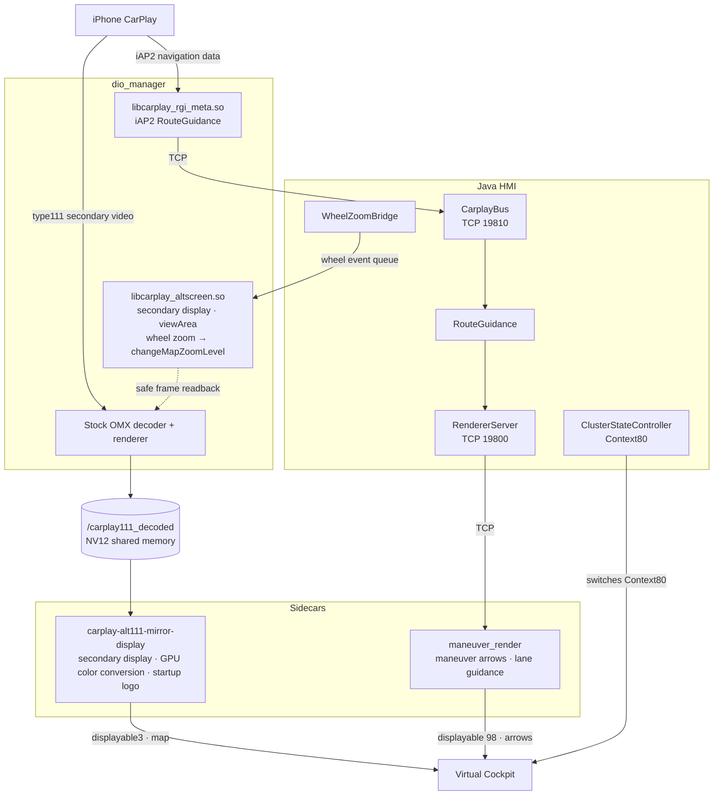

# MIB2 Toolbox — CarPlay AltScreen V3.7Fix3

**English** | [简体中文](README.md)

This project is designed for the Audi **MHI2Q** platform and displays the **native CarPlay AltScreen / secondary navigation view** directly on the vehicle's **Virtual Cockpit**. The core display path has been verified in a vehicle. Read this document in full before making changes to the head unit.

**V3.7 update: full RGI navigation-data integration is now available (built on [Luka's mib2q-carplay-rgi](https://github.com/luka-dev/mib2q-carplay-rgi)), color conversion for the secondary display now runs on the GPU, cutting whole-system CPU usage from about 80% to about 20%, the runtime watermark has been removed, and starting with V3.7 the whole project is open source under GPL-3.0.**

**V3.7Fix3 update: `INSTALL WITH RGI` / `INSTALL NO RGI` now install and enable in one step with a single reboot, removing an old version automatically; fixes the false `Another INSTALL / RESTORE is still running` error during install; fixes race conditions between secondary-display connect and exit, and requests recovery automatically when no new frames arrive for a long time; adds safe-area detection for the Q7 cluster layout.**

> [!NOTE]
> **Sister project: MMI Mirror**  
> If you want to mirror the **entire MMI center display** instead of using the native CarPlay secondary display, see:  
> **[MHI2Q-CarPlay-MMI-Mirror](https://github.com/Lanye-z/MHI2Q-CarPlay-MMI-Mirror)**

> [!TIP]
> **Community**  
> Join the community to discuss installation and use, report problems, and share vehicle test results:  
> - Telegram: [https://t.me/+xZ2pabi2nmk1MDI9](https://t.me/+xZ2pabi2nmk1MDI9)  
> - QQ group: **823297190**

> [!WARNING]
> **⚠️ A note before you start**
>
> Because freely shared test builds were previously repackaged and resold without permission, earlier versions of this project published only the runtime package and released features in stages. **Starting with V3.7, the project is fully open source**: every feature and all source code are published in this repository.
>
> The whole project is licensed under the **[GNU GPL v3.0](LICENSE)**: anyone may use, modify, and redistribute it, and anyone who redistributes binaries or modified versions must also provide the complete source under GPL-3.0. See "Licensing, authors, and third-party files" below.
>
> This is not a demonstration build. The current CarPlay AltScreen functionality is already usable in a real vehicle.
>
> This project was originally developed around our own vehicles and day-to-day use cases. **China-region (CN) AUG22 firmware has been tested in a vehicle and works normally.** AUG22 firmware for US / ER and other regions may have unknown bugs and is **not guaranteed to work 100%**; assess the risk yourself and keep your stock backup. The MHI2 platform is not supported. Do not bypass the installer's firmware checks to force installation.
>
> **Shared free of charge.** The source and installation packages are available for free on GitHub; do not pay for them.
>
> You are welcome to learn from, study, and discuss the project. If someone provides you with this project or a modified version of it, the GPL-3.0 entitles you to request the complete source from them.

> [!IMPORTANT]
> This project modifies system files on the head unit. Keep the SD card inserted and maintain stable power during installation, start, or recovery operations.  
> **After installation or recovery, fully reboot the head unit / HMI as instructed before judging the result.**
>
> Do not perform installation, update, recovery, or troubleshooting while driving.

---

## Vehicle demonstration


---

## Currently included in the public release

- Native CarPlay AltScreen
- The main CarPlay display remains available and unaffected
- Full RGI navigation-data integration (built on [Luka's mib2q-carplay-rgi](https://github.com/luka-dev/mib2q-carplay-rgi))
  - Maneuver arrows and lane guidance on the cluster
  - Can be enabled or left out at install time (`INSTALL WITH RGI` / `INSTALL NO RGI`)
- Classic / Sport dynamic layout adaptation
- Global centering
- Left steering-wheel scroll-wheel zoom
- Cluster map shows the speed-limit sign and compass, without an ETA overlay
- GPU color conversion: whole-system CPU usage cut from about 80% to about 20%
- STATUS diagnostics
- Safe installation and recovery
- Protection against interrupted installation / recovery
- Restoration of stock configuration
- Logs and SD-card backups

## Compatibility

| Item | Status |
|---|---|
| Platform | **MHI2Q** only; MHI2 is not supported |
| Firmware version | **AUG22**; the installer checks the head unit's firmware version and refuses anything other than AUG22 |
| China-region (CN) firmware | ✅ Vehicle-tested and works normally |
| US / ER and other regional firmware | ⚠️ May have unknown bugs; not guaranteed to work 100% |
| iPhone iOS version | ✅ **iOS 26** recommended; ⚠️ below iOS 18, Baidu Maps may not support the cluster display and Amap (Gaode) may show the map with the wrong aspect ratio |

> [!TIP]
> This project was adapted and tested mainly on **iOS 26**. If Baidu Maps does not appear on the cluster, or Amap (Gaode) looks stretched or squashed, update the iPhone to iOS 18 or later (iOS 26 recommended) before troubleshooting further.

---

## How it works and architecture

This project no longer relies on the early Window58 readback route. It connects directly to CarPlay's **private type111** secondary-display video stream: the stock AirPlay / OMX decoding path is kept, frames are safely read from the stock renderer and linearized into standard NV12, handed to a separate display process, and finally shown on the cluster through GLES / displayable3 / Java Context80. Full RGI receives navigation data through iAP2 RouteGuidance, and the Java HMI forwards it to a separate maneuver renderer.

### Architecture diagram



### Secondary-display path

```text
iPhone CarPlay
  ↓
private type111 secondary-display video stream
  ↓
Stock AirPlay / OMX decoding
  ↓
QNX Screen readback + linearization → standard NV12 (/carplay111_decoded)
  ↓
Separate display process (carplay-alt111-mirror-display)
  ↓
GPU shader converts NV12 → RGBA
  ↓
GLES / displayable3 (1440×542 source shown 1:1 on the 1440×455 cluster plane)
  ↓
Java/HMI Context80
  ↓
Virtual Cockpit
```

- The main CarPlay display (Main110) stays on the stock path and is not part of this display path.
- No extra decoder is introduced; the stock decoding path that already works on MHI2Q is reused to keep new variables to a minimum.
- The FULL / SMALL view areas switch dynamically within the same CarPlay session through the standard `updateViewArea`; the Classic / Sport layout follows the head unit's HMI state.
- Java/HMI is the only owner of Context80; the display process does not change the cluster Context directly.

### Performance: GPU color conversion

In earlier versions, the display process converted each decoded NV12 frame to RGBA on the CPU before uploading it to the GPU, which put a heavy load on the head unit. V3.7 moves the NV12 → RGBA color conversion to the GPU: the display process uploads the Y and UV planes as separate textures and a GLES fragment shader does the conversion, so the CPU no longer touches every pixel and no intermediate RGBA buffer is allocated.

In vehicle testing, **whole-system CPU usage dropped from about 80% to about 20%**.

### RGI navigation-data path

- `libcarplay_rgi_meta.so` receives iAP2 RouteGuidance data inside the stock CarPlay process and passes it to the Java HMI over local TCP port 19810.
- Maneuver arrows and lane guidance are sent over local TCP port 19800 to the separate `maneuver_render` process, which draws them on displayable 98. The process is supervised by `rgi_supervisor.sh` and restarted a limited number of times if it exits unexpectedly.

### Steering-wheel zoom

The Java HMI captures the left steering-wheel scroll events and writes them to an event queue. `libcarplay_altscreen.so` steps toward the target zoom level by sending standard `changeMapZoomLevel` requests to the iPhone, pacing them by fresh secondary-display frames.

---

## Source layout and building

Starting with V3.7, all source code is in this repository:

| Path | Contents | Output |
|---|---|---|
| `Toolbox/carplay_alt_screen/src/` | Preload hook for the stock CarPlay process: private111 secondary display, frame readback, viewArea, wheel zoom | `universal/libcarplay_altscreen.so` |
| `Toolbox/carplay_alt_screen/mirror_display/` | Secondary-display process (C++ / GLES / displayable3) with GPU color conversion and the embedded startup logo | `mirror_display/release/carplay-alt111-mirror-display` |
| `Toolbox/carplay_alt_screen/rgi_native/` | RGI preload hook: iAP2 RouteGuidance parsing and forwarding | `rgi_meta/libcarplay_rgi_meta.so` |
| `Toolbox/carplay_alt_screen/rgi_renderer/` | Maneuver-arrow / lane-guidance renderer | `rgi_renderer/release/maneuver_render` |
| `Toolbox/carplay_alt_screen/hmi/` | Java HMI hook: Context80, cluster layers, RGI distribution, wheel events; `stubs/` holds compile-only stock API stubs and `vendor/` the baseline JAR | `hmi/carplay_hook-basevideo3.jar` |
| `Toolbox/scripts/`, `Toolbox/GEM/` | Install / start / status / restore / diagnostic scripts and the green menu | Used from the SD card |
| `Tools/`, `BUILD-*.sh` | Build and verification tools | — |

Building requires the QNX 6.5.0 SDP ARM cross toolchain (`arm-unknown-nto-qnx6.5.0eabi-gcc`):

```sh
sh BUILD-UNIVERSAL-QNX.sh      # secondary-display hook → libcarplay_altscreen.so
sh BUILD-MIRROR-QNX.sh         # secondary-display process → carplay-alt111-mirror-display
bash Tools/build_rgi_qnx.sh    # RGI hook + renderer → libcarplay_rgi_meta.so, maneuver_render
```

Build output goes to `dev-build/` or `mirror_display/build/` (not tracked in git) and does not overwrite the vehicle files in `release/`. When you replace vehicle files, also update the matching `BUILD_INFO.txt`, `SHA256SUMS`, and the root `SHA256SUMS-SD.txt`.

---

## Installation and testing

> [!IMPORTANT]
> **This repository is now an AltScreen overlay only. It no longer contains the complete MIB2 Toolbox installer.**
>
> - The **red software-update menu** is only for installing or repairing the upstream [jilleb/mib2-toolbox](https://github.com/jilleb/mib2-toolbox).
> - **This project itself cannot be installed directly through the red software-update menu.**
> - After the upstream Toolbox is working, load this project through **`MQBCoding → Update Toolbox`** in the green menu.
> - If `Update Toolbox` reports `Script not found` or `/eso/hmi/engdefs/scripts/mqb/update_toolbox.sh` is missing, repair/reinstall the upstream Toolbox first.
> - **Upgrading from an older version no longer needs a manual restore**: the installer removes the old version automatically before installing. See section 8.

### 1. Confirm that the upstream MIB2 Toolbox works

1. Check that the head unit's firmware version is **AUG22**. The installer verifies the firmware version and refuses non-AUG22 firmware. Stop if the version differs or cannot be confirmed; do not bypass the checks. For firmware outside the China region, read "Compatibility" above first.
2. Park the vehicle and maintain stable power. Back up the current SD card and stock files, then prepare a writable **FAT32** SD card. If the old card contains `MMI-Cockpit-Carplay`, preserve that entire directory when changing cards because it contains stock backups needed for restoration.
3. If `Green Developer Menu → MQBCoding` already works and **`Update Toolbox` runs normally without a Script not found error**, skip directly to section 2.
4. If the upstream Toolbox is not installed, or the green menu exists but `Update Toolbox` is broken / missing its script, download and extract the latest complete **[jilleb/mib2-toolbox](https://github.com/jilleb/mib2-toolbox)** package. Copy the **contents** of that upstream package to the SD-card root without an extra ZIP-name folder.
5. Insert only that SD card in the head unit. Enter the red menu and select `Software updates/versions → Update → SD card → MQB Coding MIB2 Toolbox`. Wait for the update and all automatic reboots to finish; do not remove the card or cut power early.
6. After reboot, open `Green Developer Menu → MQBCoding` and confirm that **`Update Toolbox` runs normally**. If the upstream package is not recognized, check FAT32 format, root layout, and the upstream instructions. Stop if it is still rejected; do not force-flash it.

### 2. Merge this project overlay into the upstream Toolbox SD card

1. Keep the **complete upstream MIB2 Toolbox SD-card contents**. Do not delete its `metainfo2.txt`, `Toolbox/final/`, `Toolbox/GEM/mqb-main.esd`, `Toolbox/scripts/update_toolbox.sh`, or other upstream files.
2. Download the package from this repository's [Releases](https://github.com/yuedizhibo/MHI2Q-CarPlay-AltScreen/releases) page and extract it. These are compiled vehicle overlay files; **you do not need to copy source code or build directories**. Merge the package's **`Toolbox/` directory into the existing `Toolbox/` directory on the SD card**:
   - Replace same-name files with this project's versions.
   - Keep all upstream-only files.
   - When upgrading from an older project build (after completing the restore in section 8), delete the old `logo.rgba` and `watermark.rgba` from `Toolbox/carplay_alt_screen/mirror_display/release/` on the card; the new binary does not use them.
   - **Do not wipe the upstream Toolbox first, and do not treat this repository as a standalone red-menu update package.**
3. Also copy `SHA256SUMS-SD.txt` from the package root to the SD-card root for the check in the next step. If changing cards, also preserve the complete `MMI-Cockpit-Carplay` stock-backup directory.
4. The resulting layout should look like:

```text
SD card root/
├─ metainfo2.txt                  ← keep from upstream Toolbox
├─ Toolbox/
│  ├─ final/                      ← keep from upstream Toolbox
│  ├─ GEM/
│  │  ├─ mqb-main.esd             ← keep from upstream Toolbox
│  │  └─ mqb-carplayAltScreen.esd ← this project
│  ├─ scripts/
│  │  ├─ update_toolbox.sh        ← keep from upstream Toolbox
│  │  └─ ...AltScreen scripts...  ← this project
│  └─ carplay_alt_screen/         ← this project payload
└─ SHA256SUMS-SD.txt
```

5. Do not add an extra `SD card/Toolbox/` or `MHI2Q-CarPlay-AltScreen/Toolbox/` directory level.
6. From the SD-card root, run:

```sh
sha256sum -c SHA256SUMS-SD.txt
```

with Git Bash, Linux, or another environment that provides `sha256sum`. Confirm that every project file reports `OK`. This manifest validates this project's overlay files, not the complete upstream Toolbox.

### 3. Load this project's menu and scripts through the green menu

1. Reinsert the merged SD card.
2. Open `TESTMODE → Green Developer Menu → MQBCoding`.
3. Run **`Update Toolbox`**. The upstream Toolbox update script copies the SD card's `Toolbox/scripts/` and `Toolbox/GEM/` contents into the head unit.
4. Exit and reopen the green menu, then open:

```text
Customization
└─ MMI-Cockpit-Carplay
```

   Check that the menu header shows **`Version: V3.7Fix3`**. If it still shows an older version, the menu and scripts on the head unit are still the old ones, and `INSTALL` would run the old installer; run `Update Toolbox` again and continue only once the version is correct.

5. If you still see:

```text
Script not found:
/eso/hmi/engdefs/scripts/mqb/update_toolbox.sh
```

the **upstream Toolbox base installation is still broken**. Do not continue with this project's `INSTALL`; return to section 1 and repair the upstream Toolbox first.

### 4. Install the secondary display

Installing and enabling are now one step, so **only one reboot is needed**:

1. **Disconnect the iPhone / CarPlay** so navigation video is not playing during installation.
2. In the `MMI-Cockpit-Carplay` menu, select one install mode:
   - `INSTALL WITH RGI` (recommended): secondary-display map + full RGI (maneuver arrows, lane guidance).
   - `INSTALL NO RGI`: secondary-display map only, without the RGI components; useful if you only want the map or are troubleshooting RGI.
3. Wait for the final `RESULT:` line. Do not remove the card, cut power, or reboot before it appears. The installer runs five steps and shows each one live:

   ```text
   [1/5] Checking package and firmware...
   [2/5] Checking for a previous installation...   (removes an old version automatically)
   [3/5] Installing AltScreen + RGI...            (rolls back on any error)
   [4/5] Enabling autostart...
   [5/5] Verifying installation...
   ```

4. After `RESULT: SUCCESS`, **fully reboot the head unit once**, then connect the iPhone, enter CarPlay, start navigation, and check that the Virtual Cockpit shows the secondary display and updates with navigation.
5. If it shows `RESULT: FAILED`, the lines below it say which step failed, what state the head unit is in now (unchanged / rolled back / restored to stock), and what to do next. The full run is in the SD-card log shown after `Log:`.

`STATUS` shows the current mode as `INSTALL_RGI_MODE=WITH / NO`. To switch modes, simply run INSTALL again with the other mode; the installer removes the current version first.

> [!NOTE]
> Packages published on GitHub Releases show a startup watermark when the secondary display starts. This is expected. It is not the vehicle boot logo.

### 5. Check status and troubleshoot

- With CarPlay navigation running, open `STATUS`. `PHYSICAL_ROUTE_READY=SOFTWARE_CHAIN_COMPLETE` means the script observed the video decoding, display path, Context 80, and other required software conditions; you must still **visually confirm the image on the Virtual Cockpit**. `PHYSICAL_ROUTE_READY=NO` means the required conditions are not all present; check the missing items shown in the output.
- If the `MMI-Cockpit-Carplay` menu is missing, first confirm that the upstream green menu works, the SD-card directory layout is correct, and `MQBCoding → Update Toolbox` completed successfully.
- If `Update Toolbox` itself reports `Script not found`, that is an upstream Toolbox base-installation problem rather than an AltScreen installer problem. Repair the upstream Toolbox through the red software-update menu first.
- If Baidu Maps does not appear on the cluster or Amap (Gaode) shows the wrong aspect ratio, first make sure the iPhone runs iOS 18 or later (iOS 26 recommended).
- If the SD card is not detected, check FAT32, root layout, and read/write status. If `STATUS` is not ready, confirm that CarPlay is connected and navigation is producing video, then record the status and logs; do not reinstall repeatedly.
- `STORE LOGS + RESTORE` tries to collect diagnostics and **then immediately restores the stock configuration**. It is not a logs-only action. If you want to keep the AltScreen runtime installed and active, do not select it.

### 6. Logs

- Runtime logs are kept on the head unit in `/tmp/MMI-Cockpit-Carplay/`. They cover private111 connect / teardown, H.264, Screen readback, decoded SHM, display frame rate, displayable3, Context80, view-area and layout state, and system diagnostics such as CPU, temperature, and memory.
- The RGI renderer logs to `/tmp/maneuver_render.log`.
- After `STORE LOGS + RESTORE`, logs are saved to the `MMI-Cockpit-Carplay/logs/` directory on the SD card.
- When something goes wrong, save the complete logs before changing any configuration or code. When reporting an issue, attach the logs and include the firmware version and region, the Classic / Sport and FULL / SMALL layout, and how the phone was connected (phone plugged in before the head unit started / after it fully started / quick reconnect).

### 7. Restore the stock configuration

1. Insert the SD card that retains the `MMI-Cockpit-Carplay` stock-backup directory. Select `RESTORE ORIGINAL`, or `STORE LOGS + RESTORE` if you want to collect logs before restoring.
2. Wait for the final `RESULT:` line. `RESULT: SUCCESS` means the stock configuration is back; then fully reboot the head unit. Restore stops the display process, releases the Context80 display demand, removes the startup entries, removes this project's HMI JAR, and restores the HMI files and preload configuration saved before installation.
3. If it shows `RESULT: FAILED`, follow the lines below it; if they say the rollback was incomplete, **do not reboot** and run `RESTORE ORIGINAL` again. A head unit that is already stock shows `RESULT: NOTHING TO RESTORE`.

### 8. Upgrade from an older version

Upgrading **no longer needs a manual restore**:

1. Disconnect the iPhone / CarPlay and insert the SD card that retains the `MMI-Cockpit-Carplay` stock-backup directory (the card used for the original install).
2. Merge the new overlay into that SD card as described in section 2, and delete the leftover `logo.rgba` and `watermark.rgba` from the old version. Keep the `MMI-Cockpit-Carplay` directory on the card intact.
3. Run `Update Toolbox` as described in section 3, then run `INSTALL WITH RGI` or `INSTALL NO RGI` as described in section 4. When the installer finds an old version, it first runs a full, verified restore, then installs the new version.
4. After `RESULT: SUCCESS`, fully reboot the head unit once.

If the card holds no stock backup (for example, after switching SD cards), the installer stops at step 2 with a message and does not change the head unit.

Changing head-unit system files can cause a blank screen or require recovery.

---

## Contributing

**V3.7 is fully open source, and everyone is welcome to help maintain the project, fix issues, and add new features.**

- Report problems through Issues, with complete logs, the firmware version and region, the layout, and how the phone was connected. For general discussion, join the [Telegram group](https://t.me/+xZ2pabi2nmk1MDI9) or QQ group **823297190**.
- Submit fixes and new features through Pull Requests; see "Source layout and building" above for how to build. Vehicle test results on US / ER and other regional firmware are also welcome and help widen the validated scope.
- In a pull request, describe the test vehicle, firmware version, test steps, and results.
- Change one layer at a time: do not introduce a new decoder, a new Context, and broad display-structure changes in the same change, or it becomes hard to tell which layer caused a problem.
- Vehicle tests should cover cold start (phone plugged in before the head unit started / after it fully started / quick reconnect) and the four Classic / Sport × FULL / SMALL layouts, and confirm that `RESTORE ORIGINAL` still restores correctly.
- Contributed code is released with this project under GPL-3.0.

---

## Licensing, authors, and third-party files

This project is developed by [yuedizhibo](https://github.com/yuedizhibo) and [Lanye-z](https://github.com/Lanye-z). **V3.7 is fully open source**: this repository publishes all C/C++ source code, runtime binaries, installation scripts, and documentation, and the whole project is released under the **[GNU General Public License v3.0](LICENSE)** (GPL-3.0).

The GPL-3.0 allows anyone to use, study, modify, and redistribute this project, including for commercial purposes. Anyone who redistributes binaries or modified versions must provide the complete corresponding source under GPL-3.0 and keep the existing copyright and license notices.

| Part | Origin | License |
|---|---|---|
| Secondary-display path (`src/`, `mirror_display/`), install / restore / diagnostic scripts, green menu, documentation, etc. | Original to this project | GPL-3.0 |
| Java HMI and full RGI (`hmi/`, `rgi_native/`, `rgi_renderer/`) | Built on [Luka's mib2q-carplay-rgi](https://github.com/luka-dev/mib2q-carplay-rgi); renderer merged from [Allemon/mib2-carplay-rgi-altscreen](https://github.com/Allemon/mib2-carplay-rgi-altscreen) | GPL-3.0 |
| Upstream MIB2 Toolbox files | [jilleb/mib2-toolbox](https://github.com/jilleb/mib2-toolbox) | [MIT](LICENSE.TOOLBOX-MIT), GPL-3.0 compatible |
| Mirror runtime component | [Lanye-z's MMI Mirror](https://github.com/Lanye-z/MHI2Q-CarPlay-MMI-Mirror) | [Unlicense](Toolbox/carplay_alt_screen/mirror_display/release/LICENSE.MMI-MIRROR), GPL-3.0 compatible |

Other third-party files shipped with the source (such as `stb_image.h` and the Unicode data file) keep their own licenses. Keep the original license notices of third-party files.

---

## Version status

Current recommended version:

~~~text
main
└── AUG22 / V3.7Fix3
    ├── China-region (CN) firmware: vehicle-tested and working
    └── Other regional firmware: may have unknown bugs; not guaranteed to work 100%
~~~

The current public release prioritizes stable installation, normal use, and reliable recovery.

### Changelog

**V3.7Fix3**

- Fixed race conditions between secondary-display connect, exit, and routing tasks: the secondary-display request and receiver-thread creation moved out of the metadata lock, and stopping waits for the thread handle to be published before cleanup; a failed stale routing task no longer clears a new session's pending state.
- When an active secondary-display session gets no new frames for a long time, a bounded number of key-frame requests are sent, and recovery is confirmed only by a new video frame.
- Supports both quick and non-quick firewall block rules; after a helper command times out, the actual rule state is checked instead of reporting an unconfirmed port as open.
- Temporary state is isolated from the sister project MMI Mirror; install and start check whether an external display is in use, and restore keeps the other project's state.
- Added safe-area detection for the Q7 cluster layout; the green-menu version label is now `V3.7Fix3`.

**V3.7Fix2**

- Fixed V3.7Fix1 failing at step 1 with a false `Another INSTALL / RESTORE is still running`; the operation lock now uses process identity, liveness, and child tasks, and correctly handles stale locks and PID reuse.
- Fixed directory locks and file renames failing on QNX where `/tmp` points to `/dev/shmem`; these locks and state files now live on the RAM disk.
- The package and scripts are checked before installing, and a failed check leaves the existing installation untouched; install, uninstall, and restore transactions persist their state and roll back more reliably.
- Changed the cleanup order when the secondary display stops: the video session is stopped and its threads exit first, then the stock audio stop and firewall cleanup run.
- `INSTALL WITH RGI` / `INSTALL NO RGI` now install and enable in one step, so only one reboot is needed; `START` was removed from the menu.
- An old version is detected and removed automatically (full, verified restore) before installing; switching install modes no longer needs a manual restore.
- Install, restore, and `STORE LOGS + RESTORE` progress is shown live instead of all at once at the end.
- The screen shows short English steps and errors only, with full detail in the SD-card log, and always ends with a `RESULT: SUCCESS / FAILED` block that states the head unit's current state and the next step.
- If enabling autostart or the final check fails, the stock configuration is restored automatically.

**V3.7Fix1**

- The green menu now offers `INSTALL WITH RGI` / `INSTALL NO RGI`; `START` keeps the chosen mode, and a failed install rolls back automatically.
- Fixed maneuver arrows and distance progress not updating when the maneuver list is valid but `maneuverCount` is 0; a missing junction type now falls back to the maneuver type.
- Fixed state publishing failing when a cross-filesystem rename in QNX `/tmp` shared memory fails; the Java side now rejects incomplete state snapshots.
- `INSTALL`, `START`, and `STATUS` now verify the HMI JAR against `BUILD_INFO`, so an updated JAR is no longer rejected by stale hard-coded checksums.
- The cluster map ETA overlay is turned off; the speed-limit sign, compass, 30 fps secondary display, GPU color conversion, startup video, and 350 / 1000 m arrow rules are kept.

**V3.7**

- Full RGI navigation-data integration; GPU color conversion for the secondary display; runtime watermark removed; all source code open under GPL-3.0.

---

## Public-release notice

Starting with V3.7, the project is fully open source: every feature, all source code, the installable runtime package, and related documentation are public and released under GPL-3.0.

> **Shared free of charge: this project is available for free on GitHub; do not pay for it.**

---

## Acknowledgements

Thanks to the following projects and authors, whose work this project builds on:

- [Luka](https://github.com/luka-dev)'s [mib2q-carplay-rgi](https://github.com/luka-dev/mib2q-carplay-rgi): the foundation of the full RGI navigation-data integration and the Java HMI, and reference for MHI2Q CarPlay navigation guidance, HMI, and instrument-cluster interaction.
- [Allemon](https://github.com/Allemon)'s [mib2-carplay-rgi-altscreen](https://github.com/Allemon/mib2-carplay-rgi-altscreen): upstream implementation of the RGI maneuver renderer.
- [LIVI](https://github.com/f-io/LIVI): research reference for CarPlay main-display and instrument-cluster secondary-display protocol behavior.
- [jilleb](https://github.com/jilleb)'s [MIB2 High Toolbox](https://github.com/jilleb/mib2-toolbox): upstream project for the SD-card toolchain, engineering menu, and scripts.
- Everyone who tested in a vehicle, reported issues, and shared logs.
